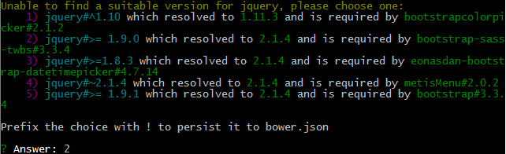

# Dynamix

Dynamix is private CMS for developer. The concept is to make a solid core with User/Role, Multilingual and Page/Block system.
And private package for anything we can have to need for customers. For exemple, a Mosaic/Gallery/Image module, a Slider/Slide/Image module, a Blog/Category/Article/Tag module...

## Requisite
  * Compass (http://compass-style.org/)
  * Grunt (http://gruntjs.com/getting-started)
  * Bower (http://bower.io/)
  * Composer (https://getcomposer.org/)
  * Oracle VM virtualBox (https://www.virtualbox.org/wiki/Downloads)
  * Vagrant (https://www.vagrantup.com/)

## Installation (local)
1. Homestead installation (VM Vagrant)
  * Add the homestead box to our local environment : vagrant box add laravel/homestead
  * Clone the homestead repository to the "dev" folder : git clone https://github.com/laravel/homestead.git Homestead
  * Configure the Homestead.yaml in the homestead folder
  * Change the environment name for "homestead" here : bootstrap/start.php :

```php 
$env = $app->detectEnvironment(array(
 
 'local' => array('homestead'),
 
));
```     
     
2. Composer Installation : composer install

3. Run Configuration Module

Google Analytics
http://packalyst.com/packages/package/thujohn/analytics

Run `php artisan config:publish thujohn/analytics` and modify the config file with your own informations.

4. Migrates

For Test the Former you should user the example Form seeder :
`php artisan migrate`
`php artisan db:seed --class=FullFormSeeder`

5. Grunt

In the assets folder (dynamix\theme\default\assets) run :
`npm install`
`bower install`
You will must choose between four option, choose the second.

`grunt` or execute the .bat file (_grunt)

## Module

1. FileManager
   
For upgrades, changes only this file `filemanager/config/config.php`

With this parameters :

```php
$upload_dir = '/uploads/';
$current_path = '../uploads/';
$thumbs_base_path = '../uploads_thumbs/';
```

And put `USE_ACCESS_KEY` to `true` with this following code to use the Config model...

```php
//[...]
define('USE_ACCESS_KEYS', TRUE); // TRUE or FALSE


// add access keys eg: array('myPrivateKey', 'someoneElseKey');
// keys should only containt (a-z A-Z 0-9 \ . _ -) characters
// if you are integrating lets say to a cms for admins, i recommend making keys randomized something like this:
// $username = 'Admin';
// $salt = 'dsflFWR9u2xQa' (a hard coded string)
// $akey = md5($username.$salt);
// DO NOT use 'key' as access key!
// Keys are CASE SENSITIVE!
include __DIR__ . '/../../../vendor/autoload.php';
$app = require_once __DIR__ . '/../../../bootstrap/start.php';
$app->boot();

$access_keys = array(Config::get('app.key'));

//--------------------------------------------------------------------------------------------------------
// YOU CAN COPY AND CHANGE THESE VARIABLES INTO FOLDERS config.php FILES TO CUSTOMIZE EACH FOLDER OPTIONS
//--------------------------------------------------------------------------------------------------------
//[...]
```

github : https://github.com/trippo/ResponsiveFilemanager
website : http://www.responsivefilemanager.com


## Team

|  | 
|---|---|
| [David Lepaux](https://github.com/dlepaux) | [Jordane Jouffroy](https://github.com/Metrakit)

## License

MIT © DynamixCMS team
       
## Credit
Inspirate by :
https://github.com/andrewelkins/Laravel-4-Bootstrap-Starter-Site
    
